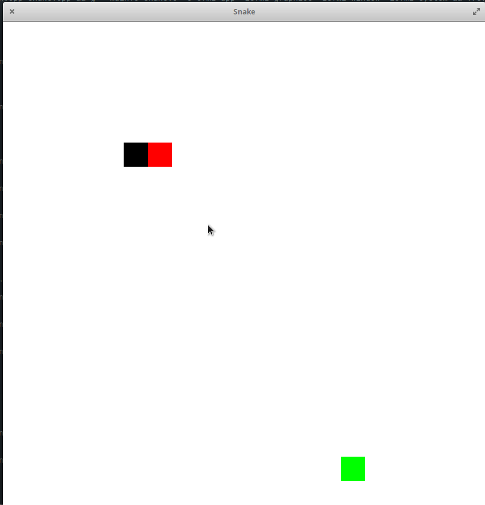

Snake

To compile the project just use this line in your terminal :

g++ -c main.cpp Snake.cpp && g++ main.o Snake.o -o sfml-app -lsfml-graphics -lsfml-window -lsfml-system

To execute the exe, just do the following : (the number after is the level)

./sfml-app 1

